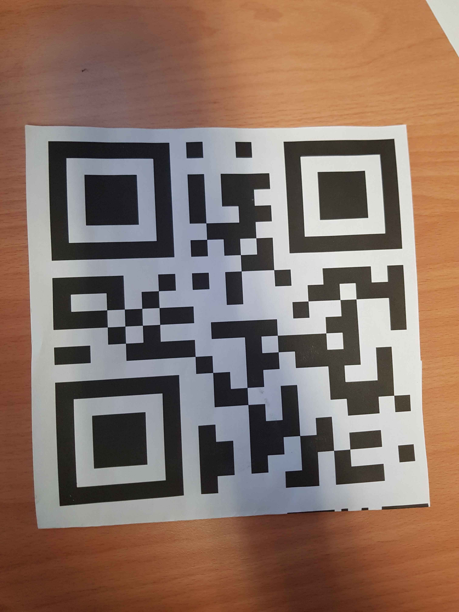
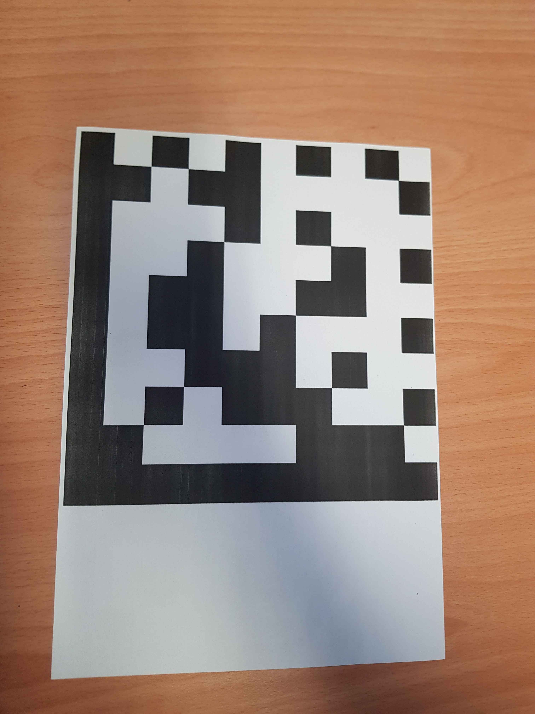
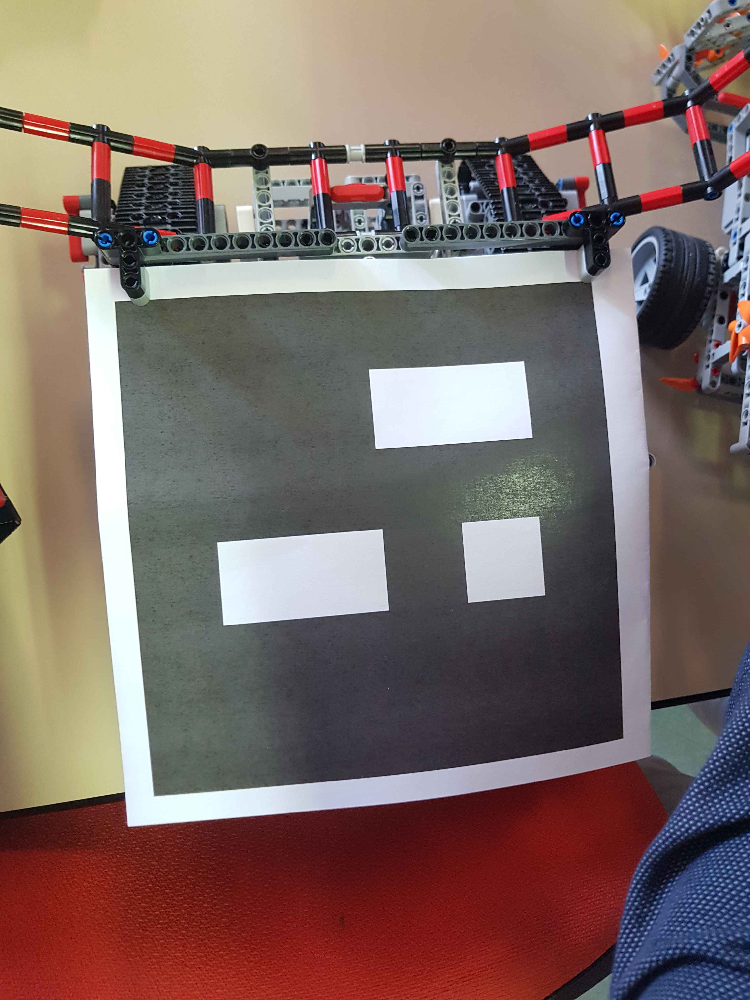

# Rapport de Projet de Master 1 – UE IDEFIX

## Introduction

Dans le cadre de notre projet de Master 1 pour l'UE IDEFIX, nous avons eu pour mission de concevoir et programmer deux robots en LEGO capables de récupérer des balles et de les ramener dans une base désignée. Le projet s'est déroulé dans une arène circulaire avec plusieurs balles, où plusieurs équipes étaient en compétition, avec la possibilité d'interférer avec les robots adverses.

### Équipe
- **Cadin Valentin** : Construction des robots, second développement du pathfinding.
- **Dorier Alexandre** : Gestion des flux vidéo de l'arène, détection des robots et des balles, premier développement du pathfinding, intégration du pathfinding avec les robots dans l'arène.

## Règles du Projet
1. Un seul NXT par robot.
2. Deux robots par équipe.
3. Dimensions maximales des robots à l'entrée du terrain : 30 cm x 30 cm x 30 cm.

## Développement des Robots

### Robot 1
#### Conception et Construction
Robot 1 est un grand robot équipé de deux chenilles, chacune alimentée par deux moteurs. La construction de ce robot a été compliquée par le fait que les multiprises disponibles pour connecter plusieurs moteurs à un port de la brique NXT ne fonctionnaient pas. En fin de compte, les quatre moteurs ont été directement reliés aux quatre ports de sortie du NXT, laissant peu de place pour d'autres automatisations telles que des pinces.

#### Caractéristiques
- **Pince avant non automatique** : Capable de pousser plusieurs balles et obstacles simultanément.
- **Grande puissance** : Les quatre moteurs lui permettent de pousser tout sur son passage.
- **Conception ingénieuse** : La pince se replie à la verticale pour respecter les dimensions maximales, puis se déploie lorsque le robot fait marche arrière.

#### Problèmes rencontrés
- **Poids élevé** : Le poids du robot mettait sous tension excessive les engrenages des chenilles, provoquant des bruits de craquement. Pour résoudre ce problème, nous avons expérimenté différentes configurations d'engrenages et renforcé la structure. Même si le problème n'a pas été complètement éliminé, il a été suffisamment atténué pour permettre un fonctionnement stable.
- **Réglages nécessaires** : De nombreux ajustements ont été nécessaires pour minimiser les problèmes d'engrenages. Ces ajustements incluaient le repositionnement des engrenages, le renforcement des points de stress et l'utilisation de lubrifiants pour réduire la friction.

### Robot 2
#### Tentative initiale (v0) – Abandonnée
La première version de Robot 2 était un grand pavé avec une grande bouche pour avaler les balles et les obstacles. Cependant, ce concept a été abandonné car il n'était pas conforme aux règles du jeu et son système de direction était inefficace. Le design initial a été conçu avec une mâchoire massive capable de s'ouvrir pour avaler tout ce qui se trouvait sur son chemin. Ce robot devait stocker les balles et obstacles à l'intérieur de sa structure. Cependant, des problèmes majeurs sont apparus lors des tests initiaux :
- **Non conformité aux règles** : Le robot ne respectait pas les dimensions maximales.
- **Problèmes de direction** : La taille et la structure du robot rendaient sa manœuvrabilité extrêmement difficile.

#### Conception et Construction finale
Après l'abandon de la première tentative, Valentin a conçu un second robot plus maniable et conforme aux règles :
- **Deux roues et une bille pour l'équilibre** : Cette configuration assure une bonne stabilité et maniabilité.
- **Petite cage avant avec mâchoire motorisée** : Capable de saisir une balle à la fois.
- **Poseur de mines** : Permet de déposer des obstacles sur le terrain pour gêner les robots adverses. Le poseur de mines utilise un petit moteur pour déposer des structures en LEGO (Hérisson tchèque) sur le terrain.

#### Caractéristiques
- **Mâchoire décorée de pics** : Efficace pour pousser les obstacles sans nécessiter de grande force.
- **Moteurs dédiés** : Deux moteurs pour les roues, un pour la mâchoire, et un petit moteur pour le poseur de mines. Cette distribution des moteurs permet une meilleure gestion de l'énergie et des capacités du robot.
- **Robustesse et maniabilité** : Construit en deux séances, ce robot est plus léger, plus rapide, et plus solide que le Robot 1. La conception a été améliorée grâce aux leçons apprises lors de la construction du premier robot.

## Développement python

### Contributions d'Alexandre
Alexandre a commencé par créer une connexion avec les robots en utilisant une connexion Bluetooth pour partager la connexion Wi-Fi. Ensuite, il a développé un programme pour contrôler les robots, d'abord de manière prédéfinie, puis en utilisant une socket pour les contrôler à partir d'un programme Python sur son ordinateur.

Il a fait une première implémentation du pathfinding en utilisant une courbe de Bézier, qui ne prenait en compte que la position du robot et sa destination. Cependant, cette version n'a pas été conservée en raison de ses performances insuffisantes.

Ensuite, il s'est concentré sur la détection des balles et des robots en utilisant la bibliothèque OpenCV. La détection des balles a été un succès : en utilisant une détection de couleur (rouge ou bleu) et en filtrant par rapport au nombre de pixels, il a réussi à obtenir une détection fiable avec les bonnes valeurs.

La détection des robots a été plus compliquée. il a d'abord tenté d'utiliser des QR codes pour identifier les robots, mais cela n'a pas fonctionné en raison de la mauvaise qualité des caméras et de l'éclairage inconsistant. Il a ensuite essayé d'utiliser des codes Datamatrix, mais sur les conseils d'un autre groupe, il a opté pour des codes ArUco, qui sont plus simples à détecter et identifier, et qui utilisent moins de points (4x4). La détection des codes ArUco a fonctionné, bien que les résultats variaient en fonction de la caméra et de l'éclairage.

Il a séparé les caméras pour améliorer la détection, mais n'a pas eu le temps d'implémenter une utilisation intelligente des différents flux. Il a ensuite relié les différents morceaux de code (connexion, pathfinding, détection) pour que les robots puissent se déplacer en fonction des balles détectées. Le programme sélectionnait la balle la plus proche, envoyait les coordonnées de la balle et du robot au pathfinding, qui renvoyait les coordonnées de la trajectoire à suivre, que le programme envoyait ensuite au robot pour qu'il se déplace. Bien que le programme essayait de mener le robot à la balle, il y avait probablement un problème de mesure entre les coordonnées de la caméra et celles du pathfinding, ce qui empêchait le robot d'atteindre correctement la balle.

### Contributions de Valentin
Valentin a développé une version finale du pathfinding basée sur des courbes de Bézier avec trois points de contrôle stratégiquement placés :
- **Point avant** : Placé devant le robot pour orienter correctement la courbe. Ce point permet d'assurer que la trajectoire initiale suit la direction actuelle du robot.
- **Point derrière la cible** : Permet au robot d'arriver derrière la cible, en direction de la base. Ce positionnement est crucial pour que le robot puisse pousser la balle directement vers la base sans devoir faire demi-tour.
- **Point de contournement** : Positionné de manière à éviter que le robot n'aborde la cible par l'avant, ce qui nécessiterait un demi-tour risquant de faire perdre la balle. Ce point est fixé à une distance calculée pour que le robot contourne la cible et se positionne correctement pour la pousser vers la base.

Cette approche permettait aux robots de pousser les balles directement vers la base sans avoir à effectuer de virages complexes, minimisant ainsi les risques de perdre les balles en cours de route.

## Conclusion

Malgré les défis liés à la taille de notre équipe et aux contraintes techniques, nous avons réussi à concevoir deux robots fonctionnels, chacun avec ses propres caractéristiques et stratégies. Le Robot 1, robuste et puissant, et le Robot 2, maniable et équipé de fonctionnalités tactiques, ont démontré nos compétences en construction LEGO et en programmation de robots autonomes.

Alexandre a joué un rôle crucial dans l'intégration et le développement des systèmes de contrôle et de détection, bien que des problèmes de précision aient limité l'efficacité finale du système. Valentin a réussi à créer un système de pathfinding efficace en utilisant des courbes de Bézier, permettant une navigation plus fluide et précise.

Notre projet a été une excellente opportunité d'appliquer nos connaissances théoriques à des défis pratiques, et nous sommes fiers des résultats obtenus malgré les obstacles rencontrés. Nous avons acquis de précieuses compétences en robotique, en programmation et en travail d'équipe, que nous pourrons appliquer dans nos futurs projets.

Voici notre [dépôt GitHub](https://github.com/AlexandreDor/30par30) pour le code source de notre projet.

## Images

### Robot 1 :

### Robot 2 :

#### Voici le systeme pour poser les Herissons Tcheques :

#### Les Herissons Tcheques :

### Codes:

#### QR Code :

#### Code Datamatrix :

#### Code ArUco :
